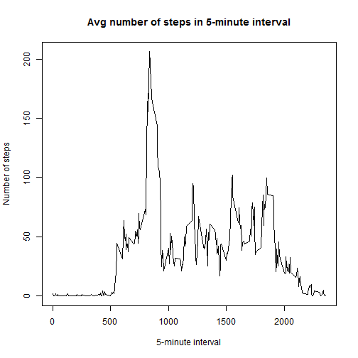

### Loading and preprocessing the data   
First we load the data and remove the rows with NA

```r
data = read.table("activity.csv", sep=",", header=TRUE);  
data$date = as.character(data$date);  
data = data[complete.cases(data),];  
```


### What is mean total number of steps taken per day?

To figure out the mean number of steps, let's first set a frame with the number of steps per day:  


```r
library(plyr)
sum.data <- ddply(data, c("date"), summarise,
               total.steps = sum(steps));
```

Now we can calculate the mean and median and do a histogram of the mean number of steps per day:  

```r
mean.steps = mean(sum.data$total.steps);
median.steps = median(sum.data$total.steps);
hist(sum.data$total.steps, main="Histogram total number of number of daily steps", xlab="daily steps", ylab="Frequency");
```

 

**The mean number of steps per day is 1.0766189 &times; 10<sup>4</sup> and the median is 10765 **


### What is the average daily activity pattern?

Let's figure it out:

```r
avg.steps.per.interval <- ddply(data, c("interval"), summarise,
               mean.steps = mean(steps));
with(avg.steps.per.interval, plot(interval, mean.steps, type = "l", main="Avg number of steps in 5-minute interval", xlab="5-minute interval", ylab="Number of steps"));
```

 
 

### Imputing missing values

For this part of the exercise, we must deal with the NA values, so let's start by re-reading the data:  


```r
data = read.table("./activity.csv", sep=",", header=TRUE);
data$date = as.character(data$date)
```

How many missing steps do we have?

```r
na.steps = data[which(is.na(data$steps)),];
#number of nas:
missing.steps.num = nrow(na.steps);
```
We have **2304** rows with missing steps.

Now, let's fill the missing steps with reasonable values:  
First calculate the average number of steps per day:

```r
avg.steps.per.day <- ddply(data, c("date"), summarise, .drop = FALSE, mean.steps = mean(steps));
```

Some days are missing all steps information, so replace it with the total average number of steps

```r
avg.steps.per.day$mean.steps=ifelse(is.na(avg.steps.per.day$mean.steps),mean.steps, avg.steps.per.day$mean.steps);
```
... and merge the average number of steps per day with the rest of the data:  

```r
data = merge(data, avg.steps.per.day, by.x="date", by.y="date");
```

For those intervals that have NA, replace the number of steps with the average on that day.

```r
num.of.intervals.in.a.day = 288;
data$date = as.Date(data$date, format = "%Y-%m-%d");
data$steps = ifelse(is.na(data$steps), data$mean.steps/num.of.intervals.in.a.day, data$steps);
```

How does the mean and the median of the filled-NA data compare with the mean and median of this data without the NA rows?

```r
sum.data <- ddply(data, c("date"), summarise,
               total.steps    = sum(steps));
new.mean.steps = mean(sum.data$total.steps);
new.median.steps = median(sum.data$total.steps);
hist(sum.data$total.steps, main="Histogram total number of number of daily steps", xlab="daily steps", ylab="Frequency");
```

 

### Compare week days activity and weekend days activity:

Add a factor for weekdays and weekends:

```r
data$day.type <- as.factor(ifelse(weekdays(data$date) %in% c("Saturday", "Sunday" ) ,"weekend", "weekday"));
data.weekdays = data[which(data$day.type=="weekday"),];
data.weekends = data[which(data$day.type=="weekend"),];
avg.steps.per.interval.on.weekdays <- ddply(data.weekdays, c("interval"), summarise,
               mean.steps = mean(steps));
avg.steps.per.interval.on.weekends <- ddply(data.weekends, c("interval"), summarise,
               mean.steps = mean(steps));
par(mfrow = c(2, 1));
with(avg.steps.per.interval.on.weekdays, plot(interval, mean.steps, type = "l", main="Weekdays", ylab="Avg number of steps"));
with(avg.steps.per.interval.on.weekends, plot(interval, mean.steps, type = "l", main="Weekends", ylab="Avg number of steps"));
```

 
